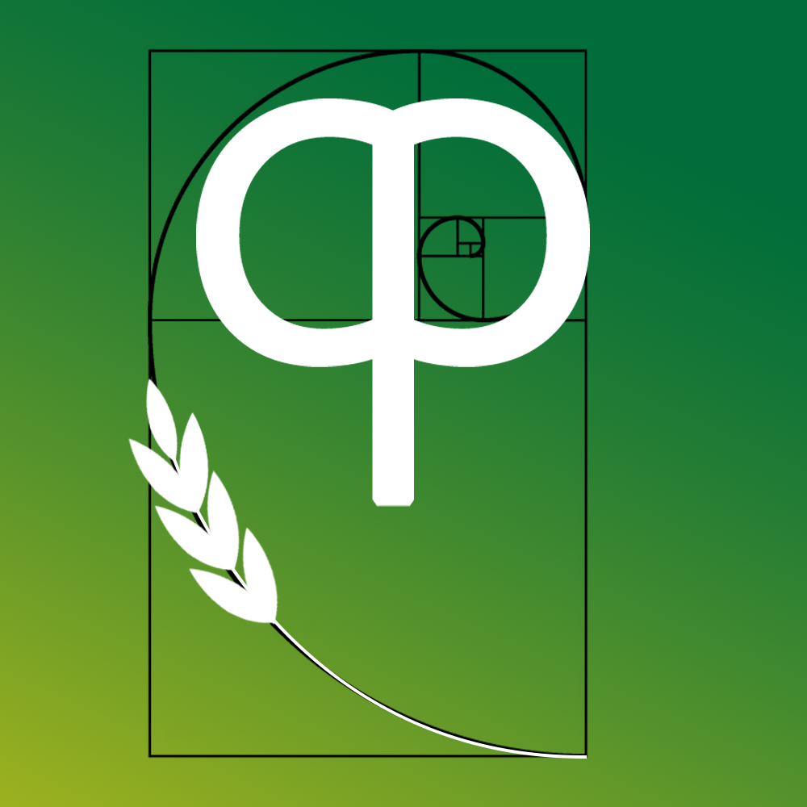

# 西农开发者联盟（民间）
## 这是什么

这是一个民间的开发者组织，也许会开发些有用的东西

## 标志

- 我们的标志初步由字母 **CP** (Computer Programmer)结合的发条组成，象征生产与开发的动力，（绝不是因为两个字母放一块比较简单）
- （也许）按照黄金分割比例在下方添加了代表西农的麦穗：

  

- 背景采用 **#006d3a-->#f8d90f** 的渐变色得到

## 待续

...
