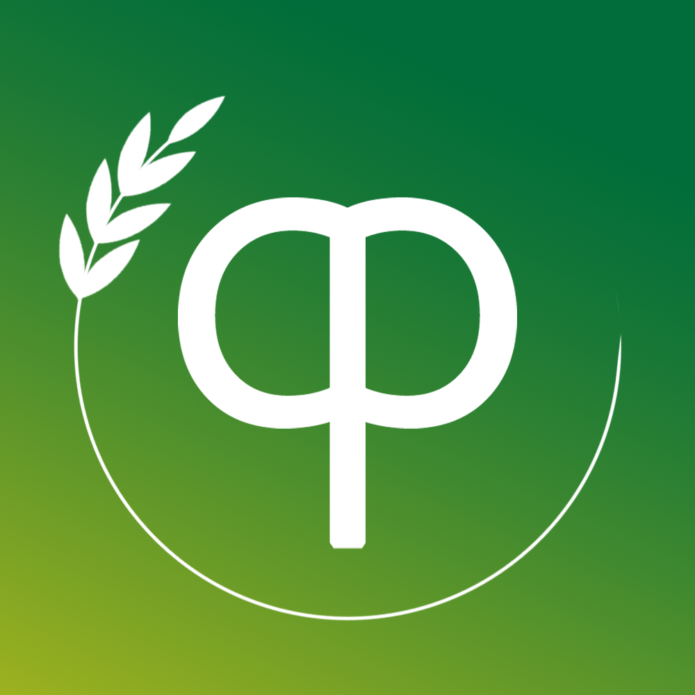

# 西农开发者联盟（民间）
## 先把我写的东西转到我（园长）仓库了，因为没人行动~

## 这是什么

这是一个民间的开发者组织，也许会开发些有用的东西

## 站点
我们的引导页:[https://cp.nwafu.icu/](https://cp.nwafu.icu/)  

## 标志

- 我们的标志初步由字母 **CP** (Computer Programmer)结合的发条组成，象征生产与开发的动力，（绝不是因为两个字母放一块比较简单）
- 代表西农的麦穗环绕在发条外侧：

- 背景采用 **#006d3a-->#f8d90f** 的渐变色得到

## 待续

...

<!--

**Here are some ideas to get you started:**

🙋‍♀️ A short introduction - what is your organization all about?
🌈 Contribution guidelines - how can the community get involved?
👩‍💻 Useful resources - where can the community find your docs? Is there anything else the community should know?
🍿 Fun facts - what does your team eat for breakfast?
🧙 Remember, you can do mighty things with the power of [Markdown](https://docs.github.com/github/writing-on-github/getting-started-with-writing-and-formatting-on-github/basic-writing-and-formatting-syntax)
-->
